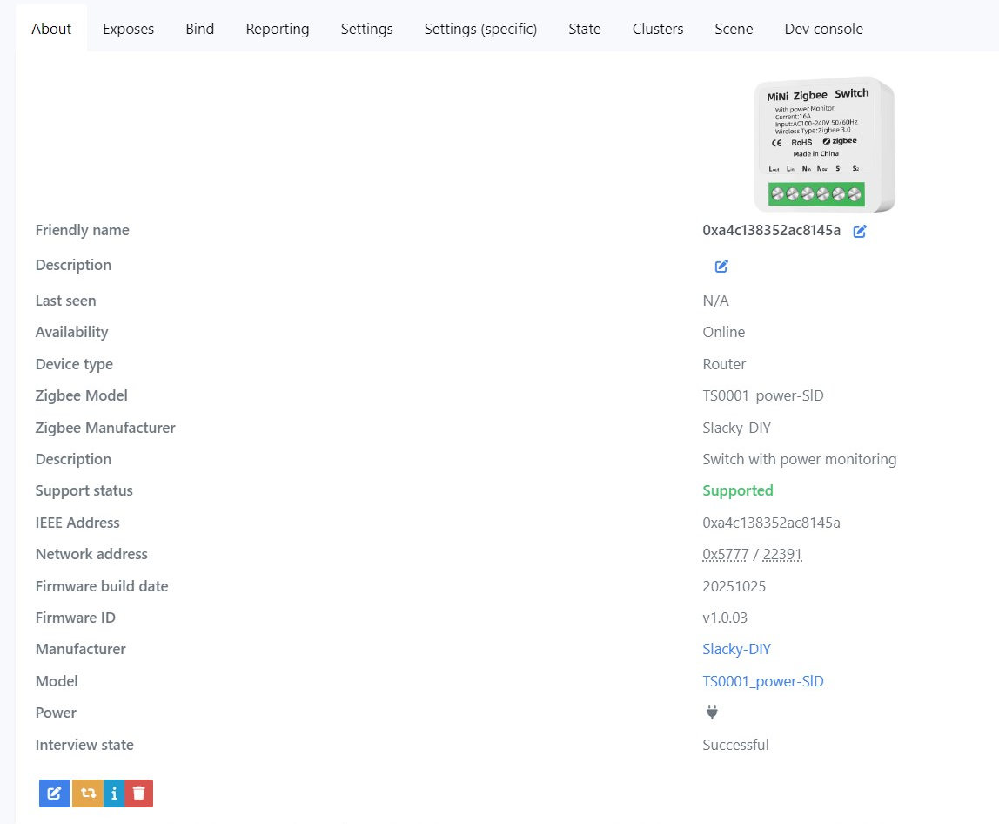
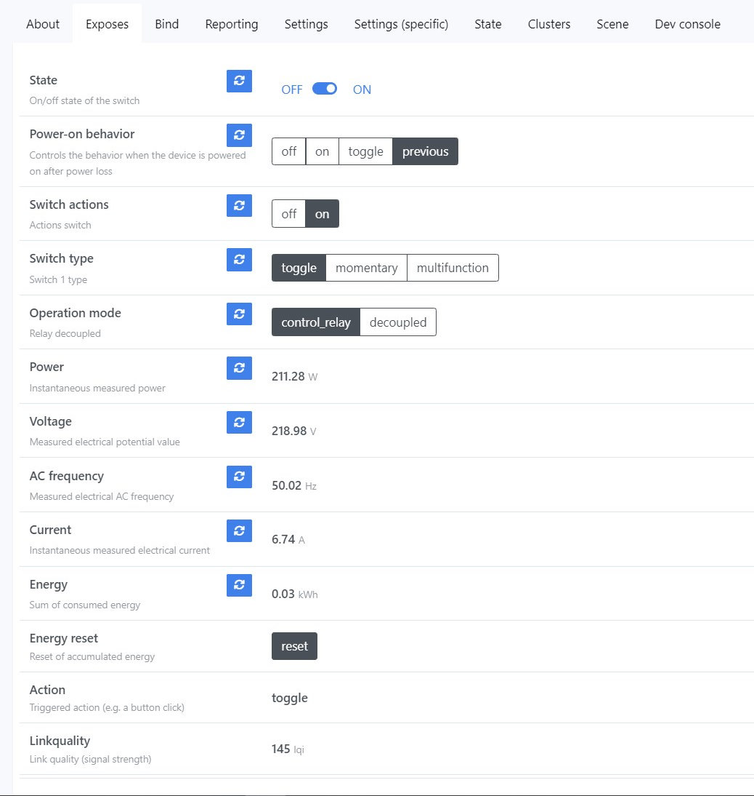

# <a id="Top">Tuya Switch with power monitoring with custom firmware</a>

### Custom firmware for Tuya Switch models

- _TZ3000_kqvb5akv

[Repository tuya_mini_relay_zrd](https://github.com/slacky1965/tuya_mini_relay_zrd)

---


**Автор не несет никакой ответственности, если вы, воспользовавшись этим проектом, превратите свой умный switch в полоумный.**

Если у вас другая сигнатура, лучше не заливать, не проверив на совпадение используемого модуля и GPIO.

## Зачем. 

Невозможно было настроить репортинг под свои нужды. Настройки были, но ни на что не влияли.

## Что получилось. 

**About**



---

## <a id="settings">Настройка</a>

**Вкладка `Exposes`**



- `State` - выводит текущее состояние реле.
- `Power-on behavior` - настраивает в какой режим переходит реле при подаче питания.
- `Switch actions` - настраивате, какую команду выполнять при нажатии на выносную клавишу.
- `Switch type` - настраивает тип клавиши: `toggle` - звонковая, `momentary` - обычная перекидная, `multifunction` - множественные нажатия, от 1 до 5, удержание и отпускание. Выбор `multifunction` автоматически приводит к отвязыванию клавиши от реле.
- `Operation mode` - настраивает управление реле с клавиши или отключает управление (отвязывание клавиши).
- `Power` - выводит текущее значение мощности.
- `Voltage` - выводит текущее значение напряжения.
- `AC frequency` - выводит текущее значение частоты.
- `Current` - выводит текущее значение силы тока.
- `Energy` - выводит текущее значение накопленной энергии.
- `Energy reset` - сбросить на 0 текущее значение накопленной энергии.
- `Action` - выводит действие клавиши в режиме `multifunction`.
	- `hold` - удержание,
	- `single` - одиночное нажатие,
	- `double` - двойное нажатие,
	- `triple` - тройное нажатие,
	- `quadruple` - четверное нажатие,
	- `quintuple` - пятерное нажатие,
	- `release` - отпустили клавишу, приходит после `hold`.

---

**Вкладка `Reporting`**


Настройка репортинга.

Репортинг кластера `OnOff` и кастомного атрибута лучше не трогать.

Репортинг остальных параметров можно настроить в соответствии с вашими желаниями. 

---

Реле поддерживает прямой биндинг. Причем не важно, отвязана клавиша или нет.

---

Немного про запись накопленной энергии. Были жалобы, что такие реле часто просто так мрут. Считывание параметров сети происходит раз в секунду. Есть подозрение, что накопленную энергию они сохраняют в одно и тоже место. В этой прошивке применен другой метод. С адреса 0x96000 по адрес 0xFC000 находится неиспользуемое пространство (Reserved Area. см. [drv_nv.h](tl_zigbee_sdk/proj/drivers/drv_nv.h) для прошивок без бутлоадера). Размер этой области составляет 0x66000 (417792 байт). Запись происходит каждый раз в новое место с шагом 256 байт. Итого мы имеем 1632 сегмента для записи. Запись происходит по кругу. Запись осуществляется по изменению параметра накопленной энергии, но не чаще 1 раза в минуту. Для визуального контроля за частотой записи, каждый раз при записи зажигается светодиод.

---

Подключение к сети происходит при длительном удержании кнопки на самом реле. Или при переключении клавиши не менее 10 раз подряд.

---

## Как обновить.

Сначала нужно скопировать два конвертора из репозитория [tuya_mini_relay_orig.js](zigbee2mqtt/converters/tuya_mini_relay_orig.js) и [ts0001_power-sld.js](zigbee2mqtt/converters/ts0001_power-sld.js) в папку `zigbee2mqtt/external_converters`.

Далее нужно добавить локальное хранилище обновлений. 

Создаем директорию `images` в директории z2m и кладем туда файл [1141-d3a3-1111114b-tuya_mini_relay_zrd.zigbee](bin/1141-d3a3-1111114b-tuya_mini_relay_zrd.zigbee).

Копируем в директорию z2m файл [local_ota_index.json](zigbee2mqtt/local_ota_index.json)

В конфиг z2m `configuration.yaml` добавляем локальное хранилище

```
ota:
  zigbee_ota_override_index_location: local_ota_index.json
```

Далее перегружаем z2m. И видим у нас новое устройство.


Далее идем в раздел OTA. И видим там свое устройство. Жмем проверить обновления.


	
Жмем на появившуюся красную кнопку. И обновляемся.

Если все не так, как описано, значит вы что-то сделали не по инструкции (не положили файл куда нужно, не перегрузили z2m) или сигнатуры вашего датчика нет в списке поддерживаемых устройств.

> [!WARNING]
> Внимание!!! Если в процессе вы обнаружите на каких-то устройствах Туя, которые возможно у вас есть еще в системе, новое обновление, то обновлять ничего не нужно!!! Иначе вы зальете в это устройство прошивку от реле и получите кирпич!!! Если же процесс обновления по ошибке уже начался, то просто обесточьте это устройство!!!

Далее ждем окончания.

После обновления нужно удалить устройство из z2m. Перегрузить z2m. Разрешить сопряжение. Подождать секунд 20 и если сопряжения не происходит, зажать кнопку на 5 секунд, пока светодиод не начнет моргать и отпустить. Начнется сопряжение.


---

Отдельная благодарность Виктору за разъяснение, как сделать более универсальную прошивку - [pvvx](https://github.com/pvvx/ZigbeeTLc)

---

Связаться со мной можно в **[Telegram](https://t.me/slacky1965)**.

### Если захотите отблагодарить автора, то это можно сделать через [ЮMoney](https://yoomoney.ru/to/4100118300223495)

---

## История версий
- 1.0.01
	- Начало.
- 1.0.02
	- Добавлены `Actions` для клавиши.
- 1.0.03
	- Изменена обработка записи накопленной энергии.
- 1.0.04
	- Изменена структура прошивки. Прошивка собрана без `bootloader'а`. 
	

[Наверх](#Top)


